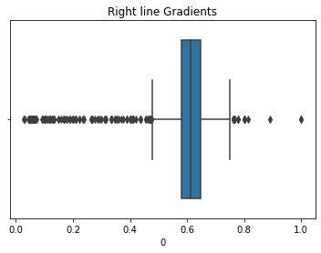

# **Finding Lane Lines on the Road** 

## Introduction

This is the first project submission for Udacity - Self Driving Car NanoDegree.

The structures of the submission are as follows:

* **P1.ipynb** is the notebook that contains the codes and visualizations.
* **test_images_output** and **test_videos_output** are the folders that contain the images and videos output

---

### Reflection

### 1. Pipelines

My pipeline consisted of 5 steps

#### Step 1

Image is read using matplotlib `imread` function and converted to gray using opencv `cvtColor`. 
The reason of converting to gray is to make certain color more contrast such as white on the
surface of dark colored road. 

After that, the image is blurred using a `GaussianBlur` to remove
noises that might reduce our next step of detecting the edges. The kernel size of the `GaussianBlur`
is also tuned to be not too high and not too low. If it's too low some noises might still present but
if it's too high some details might be missing.

#### Step 2

Step 2 is to detect the edges from the image from step 1, 
`canny` edge detection is used with lower threshold of 50 
and high threshold of 150.

#### Step 3

In step 3, the region of interest is created, the idea here is the lane is located
at half bottom of the image and also roughly the shape of triangle. 
Four vertices of polygon is used here instead of triangle to closely resemble the shape of road. 
Following is the example of the vertices drawn on the image.

The vertices is then used to mask with edges found from step 2. 
The masked edges is the area of our interest for next step.

#### Step 4

In this step, `HoughLinesP` is used to detect lines from the masked edges. I spent my time in the
step to tune the rho, threshold, min_line_length and max_line_gap parameters to find the best 
fitting, however the tuning is done manually and not exhaustive and may not have the globally
best value but it's good enough to detect the lines.

#### Step 5

This step mainly about drawing the detected lines onto the original image. Most of the time were spent
here to basically filter outliers before averaging, detecting the left and right 
lines and extrapolating it.

The outliers is noticed only when drawing the lines over video. Some of the detected lines such bad
shape from the lane mark are removed otherwise it will impact the average values and the line 
are drawn incorrectly such the following:

The way I determine the outliers is through collecting all the line gradients when
testing on the videos and use the interquantile method to find the range. 

The range of gradient values for left lines

The range of gradient values for right lines

After the outliers were removed, the gradient and y-intercept are then averaged out and coordinates
are computed from arranging the formula y=mx+c, 
where m is the gradient and c is the y intercept. We will get four coordinates in which 2
for left line and another 2 for the right lines.

These lines are then drawn into the image by using opencv `line` function and thickness is also
increased to 13 to make the line appear more visibly.

### 2. Identify potential shortcomings with your current pipeline

The shortcomings that I encountered or notice are the lane detection depend on handcrafted
technique, untested on more images such as during night or raining, 
depends on the visible marking lines

Because it's a handcrafted technique whereby lots parameters are hand tune
and is tested only on small sample of images, this pipeline might
not be able to work on general cases. 

Furthermore, because of it's only detecting visible lines on the road, if the road doesn't
have marking such as in non-urban area then this pipeline is definitely won't work.

### 3. Suggest possible improvements to your pipeline

Possible improvements might be to detect the curve lines and sharp turns and also to reduce jiggling when the
image move from frame to frame. Deep learning might be one of the possible solutions
